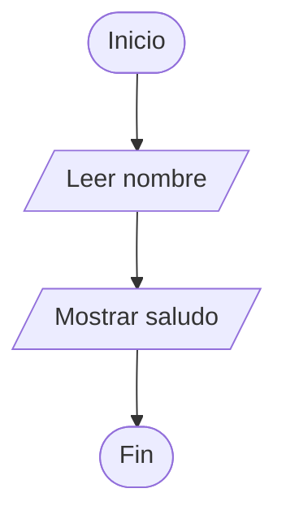
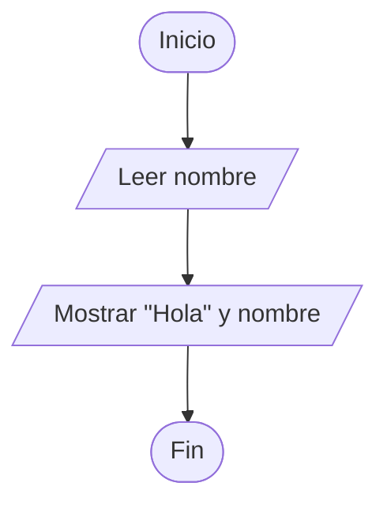
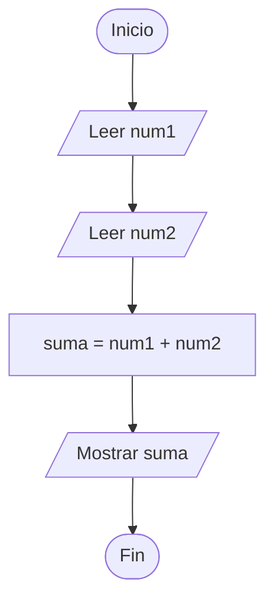
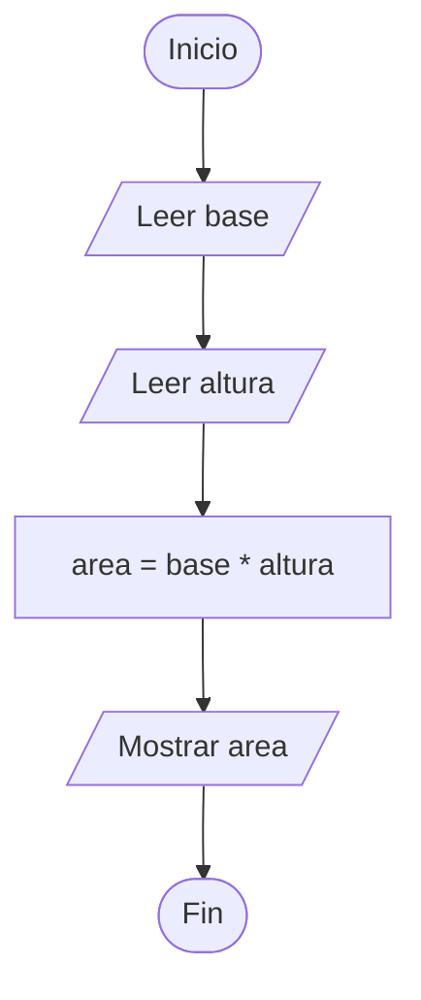
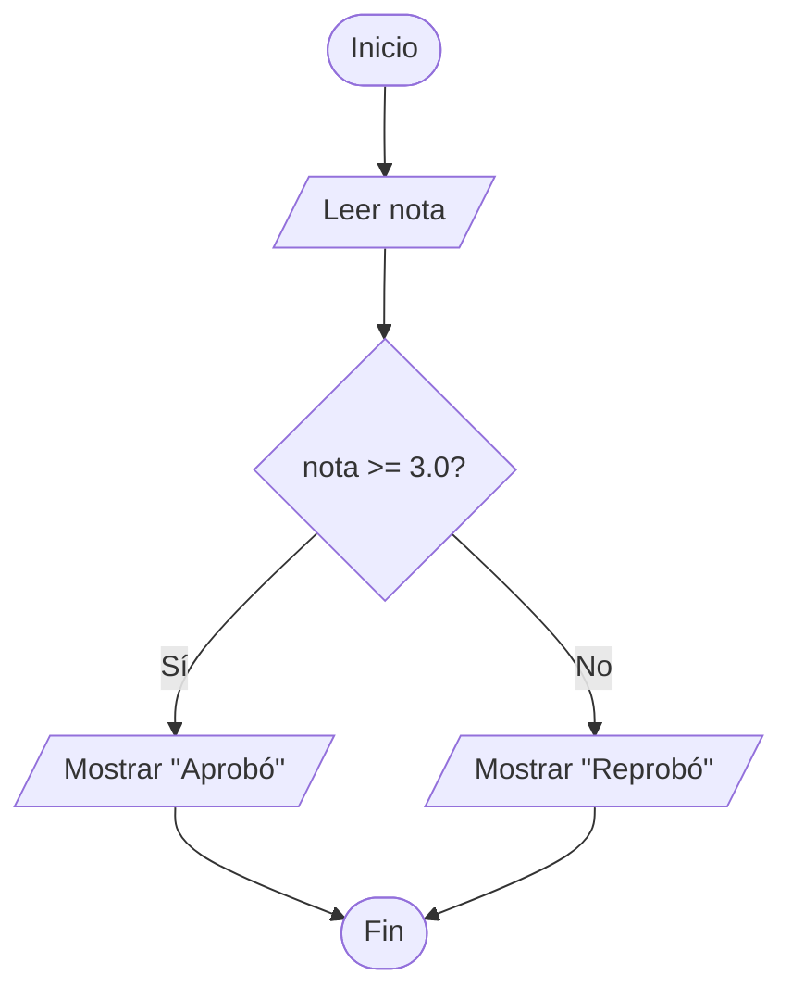

# Diagramas de Flujo

## 1. ¿Qué es un diagrama de flujo?

Un **diagrama de flujo** es una representación gráfica de un algoritmo.

En lugar de escribir todos los pasos en texto, se usan símbolos conectados por flechas para mostrar el orden de ejecución.

---

## 2. ¿Por qué usar diagramas de flujo?

Los diagramas de flujo ayudan a:

- Visualizar la lógica.
- Entender el orden de las instrucciones.
- Explicar soluciones.
- Identificar entradas, procesos y salidas.
- Preparar el pseudocódigo.
- Detectar errores antes de programar.

---

## 3. Símbolos básicos

| Símbolo | Nombre | Uso |
|---|---|---|
| Óvalo | Inicio / Fin | Marca el comienzo o final |
| Paralelogramo | Entrada / Salida | Leer o mostrar datos |
| Rectángulo | Proceso | Cálculos y asignaciones |
| Rombo | Decisión | Condiciones |
| Flecha | Flujo | Indica el orden |

---

## 4. Representación con Mermaid en GitHub

GitHub permite crear diagramas usando bloques `mermaid`.

Ejemplo:



---

# Ejemplo 1. Saludo personalizado

## Problema

Leer el nombre de una persona y mostrar un saludo.

---

## Pseudocódigo

```pseint
Algoritmo Saludo
    Definir nombre Como Caracter

    Escribir "Ingrese su nombre:"
    Leer nombre

    Escribir "Hola ", nombre
FinAlgoritmo
```

---

## Diagrama de flujo



---

# Ejemplo 2. Suma de dos números

## Pseudocódigo

```pseint
Algoritmo SumaDosNumeros
    Definir num1, num2, suma Como Entero

    Leer num1
    Leer num2

    suma <- num1 + num2

    Escribir suma
FinAlgoritmo
```

---

## Diagrama de flujo



---

# Ejemplo 3. Área de un rectángulo

## Pseudocódigo

```pseint
Algoritmo AreaRectangulo
    Definir base, altura, area Como Real

    Leer base
    Leer altura

    area <- base * altura

    Escribir area
FinAlgoritmo
```

---

## Diagrama de flujo



---

# Ejemplo 4. Promedio de tres notas

## Pseudocódigo

```pseint
Algoritmo PromedioTresNotas
    Definir nota1, nota2, nota3, promedio Como Real

    Leer nota1
    Leer nota2
    Leer nota3

    promedio <- (nota1 + nota2 + nota3) / 3

    Escribir promedio
FinAlgoritmo
```

---

## Diagrama de flujo

```mermaid
flowchart TD
    A([Inicio]) --> B[/Leer nota1/]
    B --> C[/Leer nota2/]
    C --> D[/Leer nota3/]
    D --> E[ promedio = (nota1 + nota2 + nota3) / 3 ]
    E --> F[/Mostrar promedio/]
    F --> G([Fin])
```

---

# Ejemplo 5. Condición simple visual

Aunque esta unidad se concentra en algoritmos secuenciales, es importante conocer el símbolo de decisión.

Problema:

```text
Leer una nota y determinar si es mayor o igual a 3.0.
```



---

## Recomendaciones para crear diagramas

- Todo diagrama debe tener inicio y fin.
- Las flechas deben mostrar claramente el orden.
- No se deben cruzar demasiadas flechas.
- Cada símbolo debe tener una instrucción breve.
- Las variables deben tener nombres claros.
- El diagrama debe coincidir con el pseudocódigo.

---

## Actividad sugerida

Crear diagramas de flujo para:

1. Calcular el doble de un número.
2. Calcular el área de un triángulo.
3. Calcular el total de una compra.
4. Calcular el salario semanal.
5. Calcular la nota definitiva.
